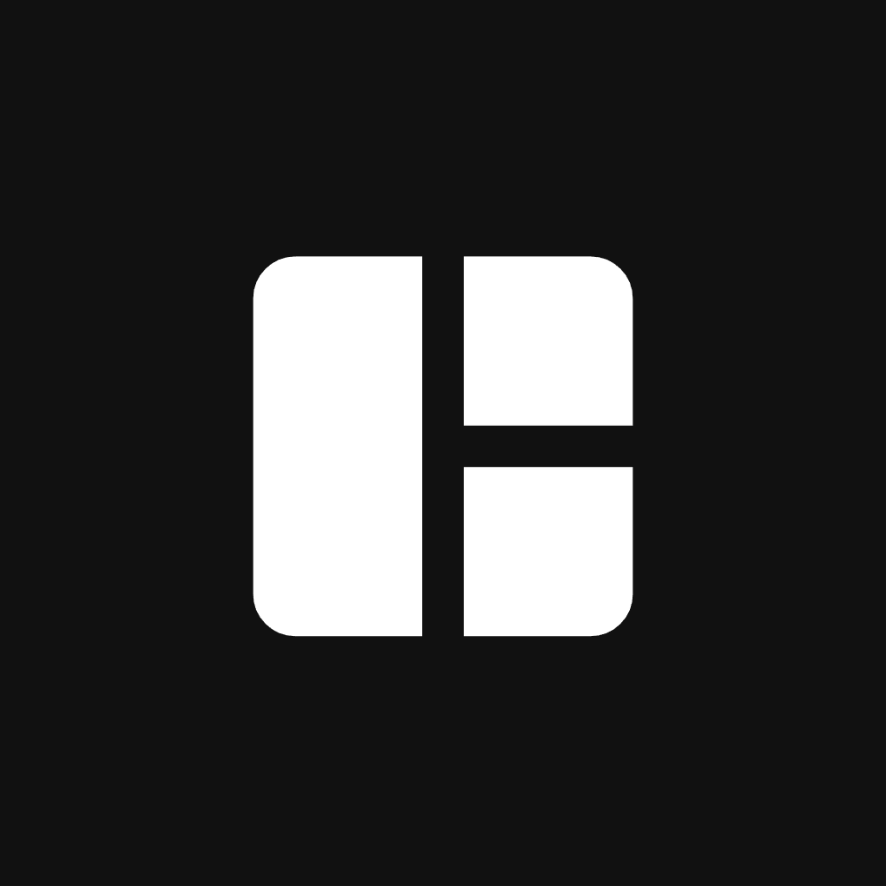

<h1>ZenPixl</h1>

A simple image tools

<h1>Screenshots</h1>

<h1>Features</h1>

- Drag & drop or click to upload images
- Supports PNG, JPG, WebP, and SVG input formats
- Scale factor buttons — 0.25× to 3×
- Preserves original aspect ratio automatically
- Auto-detects transparent images and switches to checkerboard (that png backgroud) preview
- Auto-selects PNG format for transparent images
- Live output dimension and ratio display
- Slider with live preview
- Quick preset chips — None, Small, Medium, Large, X-Large, Circle
- checkerboard background to visualize transparency
- Radius shown in pixels in real time
- Choose output format — JPG, PNG, or WebP
- JPEG/WebP quality slider (10–100%)
- Download button with dynamic label matching selected format
- Reset button to clear and start over
- Toast notifications on save and reset
- Material design 3 
- etc.

<strong>Made with ♥︎ by Zenlixir</strong>

  
  

